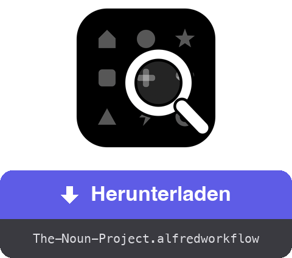

<a href="dist/The-Noun-Project.alfredworkflow?raw=true"></a>

<table>
  <tr><td align="center"><a href="README.md"></a><br><a href="README.md"><sub>English</sub></a></td><td align="center"><a href="README.fr.md"></a><br><a href="README.fr.md"><sub>Français</sub></a></td><td align="center"><a href="README.es.md"></a><br><a href="README.es.md"><sub>Español</sub></a></td><td align="center"><a href="README.it.md"></a><br><a href="README.it.md"><sub>Italiano</sub></a></td><td align="center"><a href="README.pt.md"></a><br><a href="README.pt.md"><sub>Português</sub></a></td><td align="center"><a href="README.ja.md"></a><br><a href="README.ja.md"><sub>日本語</sub></a></td><td align="center"><a href="README.zh.md"></a><br><a href="README.zh.md"><sub>中文</sub></a></td><td align="center"><a href="README.el.md"></a><br><a href="README.el.md"><sub>Ελληνικά</sub></a></td></tr>
</table>

###### ALFRED WORKFLOW
# Noun-Project-Icons suchen und herunterladen

**Durchsuche Millionen von Noun-Project-Icons und hole dir das SVG oder PNG, ohne die Tastatur zu verlassen.**

`noun haus` tippen, auswählen, **⏎** drücken. Die Datei liegt in deinem Ordner – sauber und in der richtigen Größe.


## ✨ Was es tut

- **Sofortsuche** → Ergebnisse mit Vorschaubildern; gemeinfreie Icons erscheinen zuerst, markiert mit 🟢
- **Ein ganzes Raster an Tastenkürzeln** → ⏎ lädt das Standardformat herunter, ⌥ wechselt zum anderen, ⇧ kopiert statt zu speichern, ⌃ zielt auf den Attributionshinweis (.txt), und ⌘ kombiniert – bis hin zu ⌘⌥⇧⌃⏎, das alles nacheinander kopiert
- **Optionsablauf** → das Untermenü ▸ (Autovervollständigung mit ⇥) listet alle zwölf Aktionen plus einen geführten Ablauf: Format → Größe → Zielordner
- **Attribution griffbereit** → der Attributionshinweis lässt sich als .txt speichern oder kopieren, allein oder zusammen mit dem Bild (aufeinanderfolgende Kopien landen alle im Verlauf deiner Zwischenablage)
- **Bereinigung** → der in Gratisdateien eingebettete Hinweis „Created by…“ wird entfernt (PNG beschnitten, Text aus dem SVG-Code gelöscht); die CC-BY-Lizenz verlangt dann eine Namensnennung an anderer Stelle – ⇧⌃⏎ kopiert sie
- **Deine eigene Sitzung** → ein unsichtbares Chrome im Hintergrund nutzt dein Konto auf thenounproject.com – voller Katalog, je nach Abo
- **Lokalisiert** → Oberfläche und Mitteilungen folgen deiner macOS-Sprache (Englisch, Französisch, Deutsch, Spanisch, Italienisch, Portugiesisch, Japanisch, Chinesisch, Griechisch)

## 🚀 Installation

1. `The-Noun-Project.alfredworkflow` herunterladen und doppelklicken
2. Bei Bedarf Node.js installieren: `brew install node` (Python 3 kommt mit den Command Line Tools: `xcode-select --install`)
3. Eine erste Suche starten – `noun haus` – Playwright und Chromium installieren sich von selbst (einige Minuten, nur einmal)
4. `nounctl` tippen → „Anmelden“: Ein Chrome-Fenster öffnet sich, dort auf der Website anmelden, es schließt sich von selbst. Die Sitzung bleibt in einem eigenen Profil erhalten, getrennt von deinem gewohnten Browser

Benötigt [Alfred 5](https://www.alfredapp.com) mit [Powerpack](https://www.alfredapp.com/powerpack/).

## ⚙️ Konfiguration


Backend (Browser oder offizielle API), Standardformat (SVG oder PNG – das andere wird zum „Alternativformat“), Schlüsselwort, Download-Ordner, PNG-Standardgröße, Farbe, Anzahl der Ergebnisse, Bereinigung des Hinweises, Anzeigen im Finder. Im API-Modus (Key/Secret auf [thenounproject.com/developers/apps](https://thenounproject.com/developers/apps/)) beschränkt der Gratiszugang die Downloads auf die Public Domain.

## ⌨️ Tastenkürzel

| Taste | Aktion |
|---|---|
| ⏎ | Standardformat herunterladen |
| ⌥⏎ | Alternativformat herunterladen |
| ⌃⏎ | Attributionshinweis als .txt herunterladen |
| ⇧⏎ | Standardformat in die Zwischenablage kopieren |
| ⇧⌥⏎ | Alternativformat kopieren |
| ⇧⌃⏎ | Attributionshinweis kopieren |
| ⌘⏎ | Attributionshinweis + Standardformat herunterladen |
| ⌘⌥⏎ | Attributionshinweis + Alternativformat herunterladen |
| ⌘⇧⏎ | Attributionshinweis kopieren, dann das Standardformat |
| ⌘⇧⌥⏎ | Attributionshinweis kopieren, dann das Alternativformat |
| ⌘⌥⌃⏎ | Beide Formate + Attributionshinweis herunterladen |
| ⌘⌥⇧⌃⏎ | Attributionshinweis, dann das Alternativ-, dann das Standardformat kopieren |
| ⇥ | Untermenü mit allen Aktionen (Autovervollständigung – falls ⇥ nicht mit Alfreds Universal Actions belegt ist) |
| ⌘Y | Quick-Look-Vorschau der Icon-Seite |

`nounctl`: Anmeldung, Status, Stoppen/Neustarten des Hintergrund-Browsers, Neuinstallation, Logs.

## 🔧 So funktioniert es

Ein Node/[Playwright](https://playwright.dev)-Daemon ([`workflow/server.mjs`](workflow/server.mjs)) läuft im Hintergrund mit einem unsichtbaren Chromium und einem persistenten Profil. Die Suche fragt die interne API der Website ab (ohne Konto); der Download läuft über die GraphQL-Mutation `downloadIcon` mit deiner Sitzung – die Datei kommt als Base64 an, wird bereinigt und dann gespeichert oder kopiert. Der Daemon beendet sich nach 3 Stunden Inaktivität und startet bei Bedarf neu.

Keine Zugangsdaten laufen durch den Workflow: Die Anmeldung erfolgt von Hand im Chrome-Fenster, die Cookies bleiben im lokalen Profil. Das automatisiert deine eigene Sitzung, für deinen persönlichen Gebrauch – bleib innerhalb der Grenzen deines Abos und der Nutzungsbedingungen der Website.

## 🛠 Entwicklung

```bash
./build                           # den Workflow verpacken
osascript -l JavaScript tools/make-icon.js "$PWD/workflow/icon.png"  # workflow/icon.png neu erzeugen
node tools/make-screenshots.mjs   # die Screenshots neu erzeugen
tools/make-readmes.py             # alle README-Dateien neu erzeugen
tools/make-buttons.py             # die Download-Buttons neu erzeugen
```

- `workflow/` – Quellen: `info.plist`, Python-Skripte (nur Stdlib), der Daemon `server.mjs`, `i18n.py` (9 Sprachen)
- Der Daemon stellt eine kleine lokale HTTP-API (`/search`, `/download`, `/login`, `/status`, `/quit`) auf 127.0.0.1 bereit
- `dist/` – das installierbare Paket

[](https://www.python.org) [](https://playwright.dev) [](https://claude.com)

## 📚 Referenzen

- [Alfred](https://www.alfredapp.com) · [Powerpack](https://www.alfredapp.com/powerpack/) · [Workflow-Dokumentation](https://www.alfredapp.com/help/workflows/)
- [The Noun Project](https://thenounproject.com) · [Offizielle API](https://api.thenounproject.com) · [Lizenzen](https://thenounproject.com/legal/terms-of-use/)
- [Playwright](https://playwright.dev)

## 📄 Lizenz

MIT. Die Icons selbst unterliegen weiterhin den Lizenzen von The Noun Project (CC BY oder Public Domain, gegebenenfalls Abo).

---

Erstellt von <a href='https://damiencuvillier.com' target='_blank' rel='noopener'>Damien</a> · Issues und PRs willkommen

*Der Code dieses Workflows wurde mit Unterstützung eines LLM (Claude Code) generiert — entworfen und getestet von einem Menschen ;-)*
