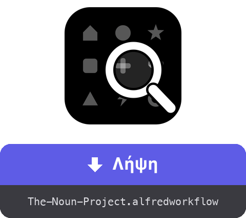

<a href="dist/The-Noun-Project.alfredworkflow?raw=true"></a>

<table>
  <tr><td align="center"><a href="README.md"></a><br><a href="README.md"><sub>English</sub></a></td><td align="center"><a href="README.fr.md"></a><br><a href="README.fr.md"><sub>Français</sub></a></td><td align="center"><a href="README.de.md"></a><br><a href="README.de.md"><sub>Deutsch</sub></a></td><td align="center"><a href="README.es.md"></a><br><a href="README.es.md"><sub>Español</sub></a></td><td align="center"><a href="README.it.md"></a><br><a href="README.it.md"><sub>Italiano</sub></a></td><td align="center"><a href="README.pt.md"></a><br><a href="README.pt.md"><sub>Português</sub></a></td><td align="center"><a href="README.ja.md"></a><br><a href="README.ja.md"><sub>日本語</sub></a></td><td align="center"><a href="README.zh.md"></a><br><a href="README.zh.md"><sub>中文</sub></a></td></tr>
</table>

###### ALFRED WORKFLOW
# Αναζήτηση και λήψη εικονιδίων του Noun Project

**Αναζήτησε ανάμεσα σε εκατομμύρια εικονίδια του Noun Project και πάρε το SVG ή το PNG χωρίς να αφήσεις το πληκτρολόγιο.**

Πληκτρολόγησε `noun maison`, διάλεξε, πάτα **⏎**. Το αρχείο φτάνει στον φάκελό σου — καθαρό, στο σωστό μέγεθος.


## ✨ Τι κάνει

- **Στιγμιαία αναζήτηση** → αποτελέσματα με μικρογραφίες· τα εικονίδια κοινού κτήματος έρχονται πρώτα, με σήμανση 🟢
- **Ένα ολόκληρο πλέγμα συντομεύσεων** → το ⏎ κατεβάζει την προεπιλεγμένη μορφή, το ⌥ περνά στην άλλη, το ⇧ αντιγράφει αντί να αποθηκεύει, το ⌃ στοχεύει την αναφορά απόδοσης (.txt) και το ⌘ τα συνδυάζει — μέχρι το ⌘⌥⇧⌃⏎ που τα αντιγράφει όλα στη σειρά
- **Ροή επιλογών** → το υπομενού ▸ (αυτόματη συμπλήρωση με ⇥) παραθέτει και τις δώδεκα ενέργειες συν μια καθοδηγούμενη ροή: μορφή → μέγεθος → φάκελος προορισμού
- **Αναφορά απόδοσης στο χέρι** → η γραμμή αναφοράς αποθηκεύεται σε .txt ή αντιγράφεται, μόνη της ή μαζί με την εικόνα (οι διαδοχικές αντιγραφές μένουν όλες στο ιστορικό του προχείρου)
- **Καθάρισμα** → η ενσωματωμένη ένδειξη «Created by…» στα δωρεάν αρχεία αφαιρείται (το PNG περικόπτεται, το κείμενο διαγράφεται από τον κώδικα SVG)· η άδεια CC BY απαιτεί τότε αναφορά απόδοσης αλλού — το ⇧⌃⏎ την αντιγράφει
- **Προσωπική συνεδρία** → ένα αόρατο Chrome στο παρασκήνιο χρησιμοποιεί τον λογαριασμό σου στο thenounproject.com — πλήρης κατάλογος, ανάλογα με τη συνδρομή σου
- **Στη γλώσσα σου** → διεπαφή και ειδοποιήσεις ακολουθούν τη γλώσσα του macOS σου (Αγγλικά, Γαλλικά, Γερμανικά, Ισπανικά, Ιταλικά, Πορτογαλικά, Ιαπωνικά, Κινεζικά, Ελληνικά)

## 🚀 Εγκατάσταση

1. Κατέβασε το `The-Noun-Project.alfredworkflow` και κάνε διπλό κλικ πάνω του
2. Εγκατέστησε το Node.js αν χρειάζεται: `brew install node` (η Python 3 έρχεται με τα Command Line Tools: `xcode-select --install`)
3. Κάνε μια πρώτη αναζήτηση — `noun maison` — το Playwright και το Chromium εγκαθίστανται μόνα τους (λίγα λεπτά, μία μόνο φορά)
4. Πληκτρολόγησε `nounctl` → «Σύνδεση»: ανοίγει ένα παράθυρο Chrome, συνδέσου στον ιστότοπο, κλείνει μόνο του. Η συνεδρία διατηρείται σε ειδικό προφίλ, ξεχωριστό από τον συνηθισμένο σου περιηγητή

Απαιτεί [Alfred 5](https://www.alfredapp.com) με το [Powerpack](https://www.alfredapp.com/powerpack/).

## ⚙️ Ρυθμίσεις


Backend (Περιηγητής ή επίσημο API), προεπιλεγμένη μορφή (SVG ή PNG — η άλλη γίνεται η «εναλλακτική»), λέξη-κλειδί, φάκελος λήψης, προεπιλεγμένο μέγεθος PNG, χρώμα, αριθμός αποτελεσμάτων, καθάρισμα της ένδειξης, εμφάνιση στο Finder. Σε λειτουργία API (κλειδί/μυστικό στο [thenounproject.com/developers/apps](https://thenounproject.com/developers/apps/)), η δωρεάν πρόσβαση περιορίζει τις λήψεις στο κοινό κτήμα.

## ⌨️ Συντομεύσεις

| Πλήκτρο | Ενέργεια |
|---|---|
| ⏎ | Λήψη της προεπιλεγμένης μορφής |
| ⌥⏎ | Λήψη της εναλλακτικής μορφής |
| ⌃⏎ | Λήψη της αναφοράς απόδοσης σε .txt |
| ⇧⏎ | Αντιγραφή της προεπιλεγμένης μορφής στο πρόχειρο |
| ⇧⌥⏎ | Αντιγραφή της εναλλακτικής μορφής |
| ⇧⌃⏎ | Αντιγραφή της αναφοράς απόδοσης |
| ⌘⏎ | Λήψη αναφοράς απόδοσης + προεπιλεγμένης μορφής |
| ⌘⌥⏎ | Λήψη αναφοράς απόδοσης + εναλλακτικής μορφής |
| ⌘⇧⏎ | Αντιγραφή της αναφοράς απόδοσης, έπειτα της προεπιλεγμένης μορφής |
| ⌘⇧⌥⏎ | Αντιγραφή της αναφοράς απόδοσης, έπειτα της εναλλακτικής μορφής |
| ⌘⌥⌃⏎ | Λήψη και των δύο μορφών + της αναφοράς απόδοσης |
| ⌘⌥⇧⌃⏎ | Αντιγραφή της αναφοράς απόδοσης, της εναλλακτικής, έπειτα της προεπιλεγμένης μορφής |
| ⇥ | Υπομενού με όλες τις ενέργειες (αυτόματη συμπλήρωση — αν το ⇥ δεν είναι δεσμευμένο στα Universal Actions του Alfred) |
| ⌘Y | Προεπισκόπηση Quick Look της σελίδας του εικονιδίου |

`nounctl`: σύνδεση, κατάσταση, διακοπή/επανεκκίνηση του περιηγητή παρασκηνίου, επανεγκατάσταση, αρχεία καταγραφής.

## 🔧 Πώς λειτουργεί

Ένας δαίμονας Node/[Playwright](https://playwright.dev) ([`workflow/server.mjs`](workflow/server.mjs)) τρέχει στο παρασκήνιο με ένα αόρατο Chromium και μόνιμο προφίλ. Η αναζήτηση περνά από το εσωτερικό API του ιστότοπου (χωρίς λογαριασμό)· η λήψη γίνεται μέσω του GraphQL mutation `downloadIcon` με τη συνεδρία σου — το αρχείο φτάνει σε base64, καθαρίζεται, έπειτα αποθηκεύεται ή αντιγράφεται. Ο δαίμονας σταματά μετά από 3 ώρες αδράνειας και επανεκκινεί όταν χρειαστεί.

Κανένα διαπιστευτήριο δεν περνά από το workflow: η σύνδεση γίνεται με το χέρι στο παράθυρο του Chrome, τα cookies μένουν στο τοπικό προφίλ. Αυτό αυτοματοποιεί τη δική σου συνεδρία, για προσωπική σου χρήση — μείνε μέσα στα όρια της συνδρομής σου και των όρων χρήσης του ιστότοπου.

## 🛠 Ανάπτυξη

```bash
(cd workflow && zip -r "../dist/The-Noun-Project.alfredworkflow" . -x '.*' -x '__pycache__/*')  # πακετάρει το workflow
osascript -l JavaScript tools/make-icon.js "$PWD/workflow/icon.png"  # αναδημιουργεί το workflow/icon.png
node tools/make-screenshots.mjs   # αναδημιουργεί τα στιγμιότυπα οθόνης
tools/make-readmes.py             # αναδημιουργεί όλα τα README
tools/make-buttons.py             # αναδημιουργεί τα κουμπιά λήψης
```

- `workflow/` — οι πηγές: `info.plist`, scripts Python (μόνο stdlib), ο δαίμονας `server.mjs`, `i18n.py` (9 γλώσσες)
- Ο δαίμονας εκθέτει ένα μικρό τοπικό HTTP API (`/search`, `/download`, `/login`, `/status`, `/quit`) στη 127.0.0.1
- `dist/` — το εγκαταστάσιμο πακέτο

## 📚 Αναφορές

- [Alfred](https://www.alfredapp.com) · [Powerpack](https://www.alfredapp.com/powerpack/) · [Τεκμηρίωση workflows](https://www.alfredapp.com/help/workflows/)
- [The Noun Project](https://thenounproject.com) · [Επίσημο API](https://api.thenounproject.com) · [Άδειες](https://thenounproject.com/legal/terms-of-use/)
- [Playwright](https://playwright.dev)

## 📄 Άδεια

MIT. Τα εικονίδια εξακολουθούν να υπόκεινται στις άδειες του The Noun Project (CC BY ή κοινό κτήμα, συνδρομή κατά περίπτωση).

---

Από τον <a href='https://damiencuvillier.com' target='_blank' rel='noopener'>Damien</a> · Issues και PRs ευπρόσδεκτα
