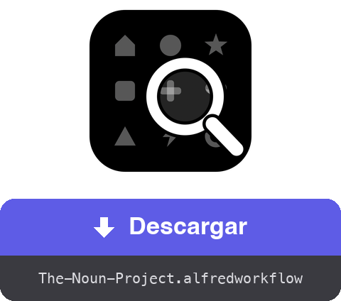

<a href="dist/The-Noun-Project.alfredworkflow?raw=true"></a>

<table>
  <tr><td align="center"><a href="README.md"></a><br><a href="README.md"><sub>English</sub></a></td><td align="center"><a href="README.fr.md"></a><br><a href="README.fr.md"><sub>Français</sub></a></td><td align="center"><a href="README.de.md"></a><br><a href="README.de.md"><sub>Deutsch</sub></a></td><td align="center"><a href="README.it.md"></a><br><a href="README.it.md"><sub>Italiano</sub></a></td><td align="center"><a href="README.pt.md"></a><br><a href="README.pt.md"><sub>Português</sub></a></td><td align="center"><a href="README.ja.md"></a><br><a href="README.ja.md"><sub>日本語</sub></a></td><td align="center"><a href="README.zh.md"></a><br><a href="README.zh.md"><sub>中文</sub></a></td><td align="center"><a href="README.el.md"></a><br><a href="README.el.md"><sub>Ελληνικά</sub></a></td></tr>
</table>

###### ALFRED WORKFLOW
# Buscar y descargar iconos de Noun Project

**Busca entre millones de pictogramas de Noun Project y llévate el SVG o el PNG sin soltar el teclado.**

Escribe `noun casa`, elige, pulsa **⏎**. El archivo aparece en tu carpeta — limpio y al tamaño correcto.


## ✨ Qué hace

- **Búsqueda instantánea** → resultados con miniaturas; los iconos de dominio público van primero, etiquetados 🟢
- **Toda una cuadrícula de atajos** → ⏎ descarga el formato por defecto, ⌥ cambia al otro, ⇧ copia en lugar de guardar, ⌃ apunta a la atribución (.txt), y ⌘ combina — hasta ⌘⌥⇧⌃⏎, que lo copia todo seguido
- **Flujo de opciones** → el submenú ▸ (autocompletado ⇥) lista las doce acciones más un flujo guiado: formato → tamaño → carpeta de destino
- **Atribución al alcance de la mano** → la mención de crédito se puede guardar como .txt o copiar, sola o junto con la imagen (las copias sucesivas quedan todas en el historial del portapapeles)
- **Limpieza** → la mención «Created by…» incrustada en los archivos gratuitos se elimina (PNG recortado, texto suprimido del código SVG); la licencia CC BY exige entonces un crédito en otro lugar — ⇧⌃⏎ lo copia
- **Tu propia sesión** → un Chrome invisible en segundo plano usa tu cuenta de thenounproject.com — catálogo completo, según tu suscripción
- **Localizado** → interfaz y notificaciones siguen el idioma de tu macOS (inglés, francés, alemán, español, italiano, portugués, japonés, chino, griego)

## 🚀 Instalación

1. Descarga `The-Noun-Project.alfredworkflow` y haz doble clic
2. Instala Node.js si hace falta: `brew install node` (Python 3 viene con las Command Line Tools: `xcode-select --install`)
3. Lanza una primera búsqueda — `noun casa` — Playwright y Chromium se instalan solos (unos minutos, una sola vez)
4. Escribe `nounctl` → «Iniciar sesión»: se abre una ventana de Chrome, identifícate en el sitio y se cierra sola. La sesión persiste en un perfil dedicado, separado de tu navegador habitual

Requiere [Alfred 5](https://www.alfredapp.com) con el [Powerpack](https://www.alfredapp.com/powerpack/).

## ⚙️ Configuración


Backend (Navegador o API oficial), formato por defecto (SVG o PNG — el otro pasa a ser el «alternativo»), palabra clave, carpeta de descarga, tamaño PNG por defecto, color, número de resultados, limpieza de la mención, mostrar en el Finder. En modo API (clave/secreto en [thenounproject.com/developers/apps](https://thenounproject.com/developers/apps/)), el acceso gratuito limita las descargas al dominio público.

## ⌨️ Atajos

| Tecla | Acción |
|---|---|
| ⏎ | Descargar el formato por defecto |
| ⌥⏎ | Descargar el formato alternativo |
| ⌃⏎ | Descargar la atribución en .txt |
| ⇧⏎ | Copiar el formato por defecto al portapapeles |
| ⇧⌥⏎ | Copiar el formato alternativo |
| ⇧⌃⏎ | Copiar la atribución |
| ⌘⏎ | Descargar la atribución + el formato por defecto |
| ⌘⌥⏎ | Descargar la atribución + el formato alternativo |
| ⌘⇧⏎ | Copiar la atribución y luego el formato por defecto |
| ⌘⇧⌥⏎ | Copiar la atribución y luego el formato alternativo |
| ⌘⌥⌃⏎ | Descargar los dos formatos + la atribución |
| ⌘⌥⇧⌃⏎ | Copiar la atribución, el alternativo y luego el formato por defecto |
| ⇥ | Submenú con todas las acciones (autocompletado — si ⇥ no está asignada a las Universal Actions de Alfred) |
| ⌘Y | Vista previa Quick Look de la página del icono |

`nounctl`: iniciar sesión, estado, parar/reiniciar el navegador de fondo, reinstalación, registros.

## 🔧 Cómo funciona

Un demonio Node/[Playwright](https://playwright.dev) ([`workflow/server.mjs`](workflow/server.mjs)) corre en segundo plano con un Chromium invisible y un perfil persistente. La búsqueda consulta la API interna del sitio (sin cuenta); la descarga pasa por la mutación GraphQL `downloadIcon` con tu sesión — el archivo llega en base64, se limpia y después se guarda o se copia. El demonio se detiene tras 3 h de inactividad y se reinicia bajo demanda.

Ninguna credencial pasa por el workflow: la conexión se hace a mano en la ventana de Chrome y las cookies se quedan en el perfil local. Este modo automatiza tu propia sesión, para tu uso personal — mantente dentro de los límites de tu suscripción y de las condiciones de uso del sitio.

## 🛠 Desarrollo

```bash
(cd workflow && zip -r "../dist/The-Noun-Project.alfredworkflow" . -x '.*' -x '__pycache__/*')  # empaqueta el workflow
osascript -l JavaScript tools/make-icon.js "$PWD/workflow/icon.png"  # regenera workflow/icon.png
node tools/make-screenshots.mjs   # regenera las capturas
tools/make-readmes.py             # regenera todos los README
tools/make-buttons.py             # regenera los botones de descarga
```

- `workflow/` — fuentes: `info.plist`, scripts Python (solo stdlib), el demonio `server.mjs`, `i18n.py` (9 idiomas)
- El demonio expone una pequeña API HTTP local (`/search`, `/download`, `/login`, `/status`, `/quit`) en 127.0.0.1
- `dist/` — el paquete instalable

## 📚 Referencias

- [Alfred](https://www.alfredapp.com) · [Powerpack](https://www.alfredapp.com/powerpack/) · [Documentación de workflows](https://www.alfredapp.com/help/workflows/)
- [The Noun Project](https://thenounproject.com) · [API oficial](https://api.thenounproject.com) · [Licencias](https://thenounproject.com/legal/terms-of-use/)
- [Playwright](https://playwright.dev)

## 📄 Licencia

MIT. Los iconos siguen sujetos a las licencias de The Noun Project (CC BY o dominio público, suscripción cuando corresponda).

---

Hecho por <a href='https://damiencuvillier.com' target='_blank' rel='noopener'>Damien</a> · Issues y PRs bienvenidos
