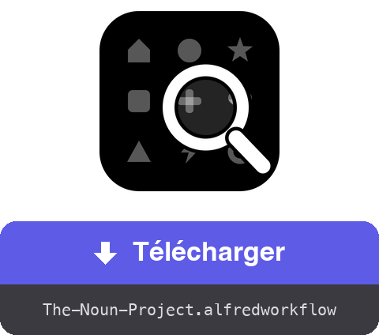

<a href="dist/The-Noun-Project.alfredworkflow?raw=true"></a>

<table>
  <tr><td align="center"><a href="README.md"></a><br><a href="README.md"><sub>English</sub></a></td><td align="center"><a href="README.de.md"></a><br><a href="README.de.md"><sub>Deutsch</sub></a></td><td align="center"><a href="README.es.md"></a><br><a href="README.es.md"><sub>Español</sub></a></td><td align="center"><a href="README.it.md"></a><br><a href="README.it.md"><sub>Italiano</sub></a></td><td align="center"><a href="README.pt.md"></a><br><a href="README.pt.md"><sub>Português</sub></a></td><td align="center"><a href="README.ja.md"></a><br><a href="README.ja.md"><sub>日本語</sub></a></td><td align="center"><a href="README.zh.md"></a><br><a href="README.zh.md"><sub>中文</sub></a></td><td align="center"><a href="README.el.md"></a><br><a href="README.el.md"><sub>Ελληνικά</sub></a></td></tr>
</table>

###### ALFRED WORKFLOW
# Chercher et télécharger des icônes Noun Project

**Cherchez parmi des millions de pictogrammes Noun Project et récupérez le SVG ou le PNG sans quitter le clavier.**

Tapez `noun maison`, choisissez, pressez **⏎**. Le fichier arrive dans votre dossier — propre, à la bonne taille.


## ✨ Ce que ça fait

- **Recherche instantanée** → résultats avec vignettes ; les icônes du domaine public arrivent en premier, étiquetées 🟢
- **Toute une grille de raccourcis** → ⏎ télécharge le format par défaut, ⌥ bascule sur l'autre, ⇧ copie au lieu d'enregistrer, ⌃ vise l'attribution (.txt), et ⌘ combine — jusqu'à ⌘⌥⇧⌃⏎ qui copie tout à la suite
- **Flux d'options** → le sous-menu ▸ (autocomplétion ⇥) liste les douze actions plus un flux guidé : format → taille → dossier de destination
- **Attribution à portée de main** → la mention de crédit s'enregistre en .txt ou se copie, seule ou avec l'image (les copies successives restent dans l'historique du presse-papiers)
- **Nettoyage** → la mention « Created by… » incrustée dans les fichiers gratuits est retirée (PNG rogné, texte supprimé du code SVG) ; la licence CC BY exige alors un crédit ailleurs — ⇧⌃⏎ le copie
- **Votre propre session** → un Chrome invisible en arrière-plan utilise votre compte thenounproject.com — catalogue complet, selon votre abonnement
- **Localisé** → interface et notifications suivent la langue de votre macOS (anglais, français, allemand, espagnol, italien, portugais, japonais, chinois, grec)

## 🚀 Installation

1. Téléchargez `The-Noun-Project.alfredworkflow` et double-cliquez dessus
2. Installez Node.js si nécessaire : `brew install node` (Python 3 vient des Command Line Tools : `xcode-select --install`)
3. Lancez une première recherche — `noun maison` — Playwright et Chromium s'installent tout seuls (quelques minutes, une seule fois)
4. Tapez `nounctl` → « Se connecter » : une fenêtre Chrome s'ouvre, identifiez-vous sur le site, elle se referme seule. La session persiste dans un profil dédié, séparé de votre navigateur habituel

Nécessite [Alfred 5](https://www.alfredapp.com) avec le [Powerpack](https://www.alfredapp.com/powerpack/).

## ⚙️ Configuration


Backend (Navigateur ou API officielle), format par défaut (SVG ou PNG — l'autre devient l'« alternatif »), mot-clé, dossier de téléchargement, taille PNG par défaut, couleur, nombre de résultats, nettoyage de la mention, révélation dans le Finder. En mode API (clé/secret sur [thenounproject.com/developers/apps](https://thenounproject.com/developers/apps/)), l'accès gratuit limite les téléchargements au domaine public.

## ⌨️ Raccourcis

| Touche | Action |
|---|---|
| ⏎ | Télécharger le format par défaut |
| ⌥⏎ | Télécharger le format alternatif |
| ⌃⏎ | Télécharger l'attribution en .txt |
| ⇧⏎ | Copier le format par défaut dans le presse-papiers |
| ⇧⌥⏎ | Copier le format alternatif |
| ⇧⌃⏎ | Copier l'attribution |
| ⌘⏎ | Télécharger l'attribution + le format par défaut |
| ⌘⌥⏎ | Télécharger l'attribution + le format alternatif |
| ⌘⇧⏎ | Copier l'attribution, puis le format par défaut |
| ⌘⇧⌥⏎ | Copier l'attribution, puis le format alternatif |
| ⌘⌥⌃⏎ | Télécharger les deux formats + l'attribution |
| ⌘⌥⇧⌃⏎ | Copier l'attribution, l'alternatif, puis le format par défaut |
| ⇥ | Sous-menu de toutes les actions (autocomplétion — si ⇥ n'est pas assignée aux Universal Actions d'Alfred) |
| ⌘Y | Aperçu Quick Look de la page de l'icône |

`nounctl` : connexion, état, arrêt/redémarrage du navigateur de fond, réinstallation, journaux.

## 🔧 Comment ça marche

Un démon Node/[Playwright](https://playwright.dev) ([`workflow/server.mjs`](workflow/server.mjs)) tourne en arrière-plan avec un Chromium invisible et un profil persistant. La recherche interroge l'API interne du site (sans compte) ; le téléchargement passe par la mutation GraphQL `downloadIcon` avec votre session — le fichier arrive en base64, est nettoyé, puis enregistré ou copié. Le démon s'arrête après 3 h d'inactivité et redémarre à la demande.

Aucun identifiant ne transite par le workflow : la connexion se fait à la main dans la fenêtre Chrome, les cookies restent dans le profil local. Ce mode automatise votre propre session, pour votre usage personnel — restez dans les limites de votre abonnement et des CGU du site.

## 🛠 Développement

```bash
(cd workflow && zip -r "../dist/The-Noun-Project.alfredworkflow" . -x '.*' -x '__pycache__/*')  # empaquette le workflow
osascript -l JavaScript tools/make-icon.js "$PWD/workflow/icon.png"  # régénère workflow/icon.png
node tools/make-screenshots.mjs   # régénère les captures
tools/make-readmes.py             # régénère tous les README
tools/make-buttons.py             # régénère les boutons de téléchargement
```

- `workflow/` — sources : `info.plist`, scripts Python (stdlib uniquement), le démon `server.mjs`, `i18n.py` (9 langues)
- Le démon expose une petite API HTTP locale (`/search`, `/download`, `/login`, `/status`, `/quit`) sur 127.0.0.1
- `dist/` — le paquet installable

## 📚 Références

- [Alfred](https://www.alfredapp.com) · [Powerpack](https://www.alfredapp.com/powerpack/) · [Documentation des workflows](https://www.alfredapp.com/help/workflows/)
- [The Noun Project](https://thenounproject.com) · [API officielle](https://api.thenounproject.com) · [Licences](https://thenounproject.com/legal/terms-of-use/)
- [Playwright](https://playwright.dev)

## 📄 Licence

MIT. Les icônes restent soumises aux licences The Noun Project (CC BY ou domaine public, abonnement le cas échéant).

---

Réalisé par <a href='https://damiencuvillier.com' target='_blank' rel='noopener'>Damien</a> · Issues et PRs bienvenues
