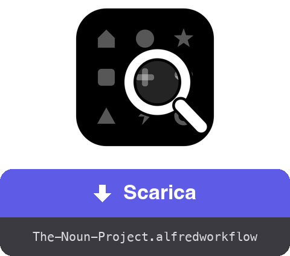
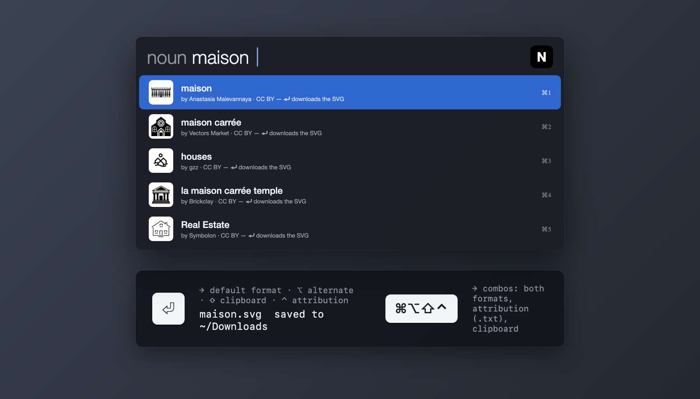
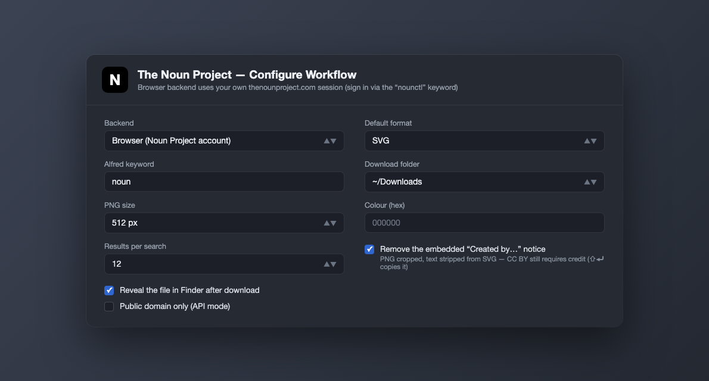

<a href="dist/The-Noun-Project.alfredworkflow?raw=true"></a>

<table>
  <tr><td align="center"><a href="README.md"></a><br><a href="README.md"><sub>English</sub></a></td><td align="center"><a href="README.fr.md"></a><br><a href="README.fr.md"><sub>Français</sub></a></td><td align="center"><a href="README.de.md"></a><br><a href="README.de.md"><sub>Deutsch</sub></a></td><td align="center"><a href="README.es.md"></a><br><a href="README.es.md"><sub>Español</sub></a></td><td align="center"><a href="README.pt.md"></a><br><a href="README.pt.md"><sub>Português</sub></a></td><td align="center"><a href="README.ja.md"></a><br><a href="README.ja.md"><sub>日本語</sub></a></td><td align="center"><a href="README.zh.md"></a><br><a href="README.zh.md"><sub>中文</sub></a></td><td align="center"><a href="README.el.md"></a><br><a href="README.el.md"><sub>Ελληνικά</sub></a></td></tr>
</table>

###### ALFRED WORKFLOW
# Cerca e scarica icone Noun Project

**Cerca tra milioni di pittogrammi Noun Project e ottieni l'SVG o il PNG senza staccare le mani dalla tastiera.**

Digita `noun casa`, scegli, premi **⏎**. Il file arriva nella tua cartella — pulito, alla dimensione giusta.



## ✨ Cosa fa

- **Ricerca istantanea** → risultati con miniature; le icone di pubblico dominio arrivano per prime, contrassegnate 🟢
- **Un'intera griglia di scorciatoie** → ⏎ scarica il formato predefinito, ⌥ passa all'altro, ⇧ copia invece di salvare, ⌃ punta alla menzione di attribuzione (.txt), e ⌘ combina — fino a ⌘⌥⇧⌃⏎, che copia tutto in sequenza
- **Flusso di opzioni** → il sottomenu ▸ (autocompletamento ⇥) elenca tutte e dodici le azioni più un flusso guidato: formato → dimensione → cartella di destinazione
- **Attribuzione a portata di mano** → la menzione di attribuzione si salva in .txt o si copia, da sola o insieme all'immagine (le copie successive restano tutte nella cronologia degli appunti)
- **Pulizia** → la dicitura «Created by…» incorporata nei file gratuiti viene rimossa (PNG ritagliato, testo eliminato dal codice SVG); la licenza CC BY richiede allora un credito altrove — ⇧⌃⏎ lo copia
- **Sessione personale** → un Chrome invisibile in background usa il tuo account thenounproject.com — catalogo completo, in base al tuo abbonamento
- **Localizzato** → interfaccia e notifiche seguono la lingua del tuo macOS (inglese, francese, tedesco, spagnolo, italiano, portoghese, giapponese, cinese, greco)

## 🚀 Installazione

1. Scarica `The-Noun-Project.alfredworkflow` e fai doppio clic
2. Installa Node.js se necessario: `brew install node` (Python 3 arriva con i Command Line Tools: `xcode-select --install`)
3. Lancia una prima ricerca — `noun casa` — Playwright e Chromium si installano da soli (qualche minuto, una sola volta)
4. Digita `nounctl` → «Accedi»: si apre una finestra Chrome, effettua l'accesso al sito e la finestra si chiude da sola. La sessione persiste in un profilo dedicato, separato dal tuo browser abituale

Richiede [Alfred 5](https://www.alfredapp.com) con il [Powerpack](https://www.alfredapp.com/powerpack/).

## ⚙️ Configurazione



Backend (Browser o API ufficiale), formato predefinito (SVG o PNG — l'altro diventa l'«alternativo»), parola chiave, cartella di download, dimensione PNG predefinita, colore, numero di risultati, pulizia della dicitura, visualizzazione nel Finder. In modalità API (chiave/segreto su [thenounproject.com/developers/apps](https://thenounproject.com/developers/apps/)), l'accesso gratuito limita i download al pubblico dominio.

## ⌨️ Scorciatoie

| Tasto | Azione |
|---|---|
| ⏎ | Scarica il formato predefinito |
| ⌥⏎ | Scarica il formato alternativo |
| ⌃⏎ | Scarica la menzione di attribuzione in .txt |
| ⇧⏎ | Copia il formato predefinito negli appunti |
| ⇧⌥⏎ | Copia il formato alternativo |
| ⇧⌃⏎ | Copia la menzione di attribuzione |
| ⌘⏎ | Scarica l'attribuzione + il formato predefinito |
| ⌘⌥⏎ | Scarica l'attribuzione + il formato alternativo |
| ⌘⇧⏎ | Copia l'attribuzione, poi il formato predefinito |
| ⌘⇧⌥⏎ | Copia l'attribuzione, poi il formato alternativo |
| ⌘⌥⌃⏎ | Scarica entrambi i formati + l'attribuzione |
| ⌘⌥⇧⌃⏎ | Copia l'attribuzione, l'alternativo, poi il formato predefinito |
| ⇥ | Sottomenu con tutte le azioni (autocompletamento — se ⇥ non è assegnato alle Universal Actions di Alfred) |
| ⌘Y | Anteprima Quick Look della pagina dell'icona |

`nounctl`: accesso, stato, arresto/riavvio del browser in background, reinstallazione, log.

## 🔧 Come funziona

Un demone Node/[Playwright](https://playwright.dev) ([`workflow/server.mjs`](workflow/server.mjs)) gira in background con un Chromium invisibile e un profilo persistente. La ricerca interroga l'API interna del sito (senza bisogno di account); il download passa per la mutation GraphQL `downloadIcon` con la tua sessione — il file arriva in base64, viene ripulito, poi salvato o copiato. Il demone si ferma dopo 3 ore di inattività e riparte su richiesta.

Nessuna credenziale passa per il workflow: l'accesso avviene a mano nella finestra Chrome e i cookie restano nel profilo locale. Questa modalità automatizza la tua stessa sessione, per uso personale — resta nei limiti del tuo abbonamento e dei termini di servizio del sito.

## 🛠 Sviluppo

```bash
(cd workflow && zip -r "../dist/The-Noun-Project.alfredworkflow" . -x '.*' -x '__pycache__/*')  # impacchetta il workflow
osascript -l JavaScript tools/make-icon.js "$PWD/workflow/icon.png"  # rigenera workflow/icon.png
node tools/make-screenshots.mjs   # rigenera gli screenshot
tools/make-readmes.py             # rigenera tutti i README
tools/make-buttons.py             # rigenera i pulsanti di download
```

- `workflow/` — sorgenti: `info.plist`, script Python (solo stdlib), il demone `server.mjs`, `i18n.py` (9 lingue)
- Il demone espone una piccola API HTTP locale (`/search`, `/download`, `/login`, `/status`, `/quit`) su 127.0.0.1
- `dist/` — il pacchetto installabile

## 📚 Riferimenti

- [Alfred](https://www.alfredapp.com) · [Powerpack](https://www.alfredapp.com/powerpack/) · [Documentazione dei workflow](https://www.alfredapp.com/help/workflows/)
- [The Noun Project](https://thenounproject.com) · [API ufficiale](https://api.thenounproject.com) · [Licenze](https://thenounproject.com/legal/terms-of-use/)
- [Playwright](https://playwright.dev)

## 📄 Licenza

MIT. Le icone restano soggette alle licenze The Noun Project (CC BY o pubblico dominio, abbonamento ove applicabile).

---

Realizzato da <a href='https://damiencuvillier.com' target='_blank' rel='noopener'>Damien</a> · Issue e PR benvenute
