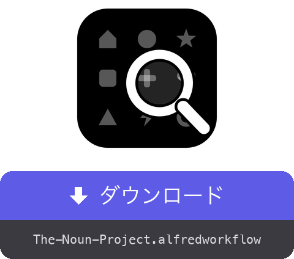

<a href="dist/The-Noun-Project.alfredworkflow?raw=true"></a>

<table>
  <tr><td align="center"><a href="README.md"></a><br><a href="README.md"><sub>English</sub></a></td><td align="center"><a href="README.fr.md"></a><br><a href="README.fr.md"><sub>Français</sub></a></td><td align="center"><a href="README.de.md"></a><br><a href="README.de.md"><sub>Deutsch</sub></a></td><td align="center"><a href="README.es.md"></a><br><a href="README.es.md"><sub>Español</sub></a></td><td align="center"><a href="README.it.md"></a><br><a href="README.it.md"><sub>Italiano</sub></a></td><td align="center"><a href="README.pt.md"></a><br><a href="README.pt.md"><sub>Português</sub></a></td><td align="center"><a href="README.zh.md"></a><br><a href="README.zh.md"><sub>中文</sub></a></td><td align="center"><a href="README.el.md"></a><br><a href="README.el.md"><sub>Ελληνικά</sub></a></td></tr>
</table>

###### ALFRED WORKFLOW
# Noun Project のアイコンを検索してダウンロード

**数百万点の Noun Project アイコンを検索し、キーボードから手を離さずに SVG や PNG を取得。**

`noun maison` と入力して選び、**⏎**。ファイルは指定のフォルダに、クリーンな状態で、ちょうどよいサイズで届きます。


## ✨ できること

- **即時検索** → サムネイル付きの結果を表示。パブリックドメインのアイコンが 🟢 付きで先頭に並びます
- **組み合わせ自在のショートカット** → ⏎ で既定の形式をダウンロード、⌥ でもう一方の形式に切り替え、⇧ で保存の代わりにコピー、⌃ で帰属表示（.txt）を対象に、そして ⌘ でそれらを組み合わせ — ⌘⌥⇧⌃⏎ ならすべてを続けてコピーします
- **オプションのフロー** → ▸ サブメニュー（⇥ で自動補完）には 12 のアクションすべてに加え、ガイド付きフロー（形式 → サイズ → 保存先フォルダ）が並びます
- **帰属表示もすぐ手元に** → 帰属表示は .txt として保存もコピーも可能 — 単独でも画像と一緒でも（連続したコピーはすべてクリップボードの履歴に残ります）
- **クリーンアップ** → 無料ファイルに埋め込まれた「Created by…」の表記を除去します（PNG はトリミング、SVG はコードからテキストを削除）。その場合 CC BY では別の場所でのクレジット表記が必要になります — ⇧⌃⏎ でコピーできます
- **あなた自身のセッション** → バックグラウンドの不可視の Chrome があなたの thenounproject.com アカウントを使用 — 契約プランに応じてフルカタログにアクセスできます
- **多言語対応** → インターフェースと通知は macOS の言語に追随します（英語・フランス語・ドイツ語・スペイン語・イタリア語・ポルトガル語・日本語・中国語・ギリシャ語）

## 🚀 インストール

1. `The-Noun-Project.alfredworkflow` をダウンロードしてダブルクリック
2. 必要なら Node.js をインストール：`brew install node`（Python 3 は Command Line Tools に含まれます：`xcode-select --install`）
3. はじめての検索 — `noun maison` — を実行すると、Playwright と Chromium が自動でインストールされます（数分、初回のみ）
4. `nounctl` と入力 → 「ログイン」を選択：Chrome のウインドウが開くのでサイト上でログインすると、ウインドウは自動で閉じます。セッションは普段のブラウザとは別の専用プロファイルに保持されます

[Alfred 5](https://www.alfredapp.com) と [Powerpack](https://www.alfredapp.com/powerpack/) が必要です。

## ⚙️ 設定


バックエンド（ブラウザまたは公式 API）、既定の形式（SVG または PNG — もう一方が「代替」になります）、キーワード、ダウンロード先フォルダ、PNG の既定サイズ、色、結果件数、表記のクリーンアップ、Finder での表示。API モード（キー／シークレットは [thenounproject.com/developers/apps](https://thenounproject.com/developers/apps/) で取得）の場合、無料プランではダウンロードがパブリックドメインに限られます。

## ⌨️ ショートカット

| キー | 動作 |
|---|---|
| ⏎ | 既定の形式をダウンロード |
| ⌥⏎ | 代替形式をダウンロード |
| ⌃⏎ | 帰属表示を .txt でダウンロード |
| ⇧⏎ | 既定の形式をクリップボードにコピー |
| ⇧⌥⏎ | 代替形式をコピー |
| ⇧⌃⏎ | 帰属表示をコピー |
| ⌘⏎ | 帰属表示 + 既定の形式をダウンロード |
| ⌘⌥⏎ | 帰属表示 + 代替形式をダウンロード |
| ⌘⇧⏎ | 帰属表示、続けて既定の形式をコピー |
| ⌘⇧⌥⏎ | 帰属表示、続けて代替形式をコピー |
| ⌘⌥⌃⏎ | 両方の形式 + 帰属表示をダウンロード |
| ⌘⌥⇧⌃⏎ | 帰属表示、代替形式、最後に既定の形式をコピー |
| ⇥ | 全アクションのサブメニュー（自動補完 — ⇥ が Alfred の Universal Actions に割り当てられていない場合） |
| ⌘Y | アイコンページを Quick Look でプレビュー |

`nounctl`：ログイン、状態確認、バックグラウンドブラウザの停止／再起動、再インストール、ログの表示。

## 🔧 仕組み

Node/[Playwright](https://playwright.dev) のデーモン（[`workflow/server.mjs`](workflow/server.mjs)）が、不可視の Chromium と永続プロファイルとともにバックグラウンドで動作します。検索はサイトの内部 API を照会し（アカウント不要）、ダウンロードはあなたのセッションで GraphQL ミューテーション `downloadIcon` を実行 — ファイルは base64 で届き、クリーンアップされたのち保存またはコピーされます。デーモンは 3 時間操作がないと停止し、必要になれば再起動します。

認証情報がワークフローを経由することはありません：ログインは Chrome のウインドウで手動で行い、Cookie はローカルのプロファイルに残ります。これはあなた自身のセッションを個人利用のために自動化するものです — 契約プランとサイトの利用規約の範囲内でお使いください。

## 🛠 開発

```bash
(cd workflow && zip -r "../dist/The-Noun-Project.alfredworkflow" . -x '.*' -x '__pycache__/*')  # ワークフローをパッケージ化
osascript -l JavaScript tools/make-icon.js "$PWD/workflow/icon.png"  # workflow/icon.png を再生成
node tools/make-screenshots.mjs   # スクリーンショットを再生成
tools/make-readmes.py             # README をすべて再生成
tools/make-buttons.py             # ダウンロードボタンを再生成
```

- `workflow/` — ソース一式：`info.plist`、Python スクリプト（標準ライブラリのみ）、デーモン `server.mjs`、`i18n.py`（9 言語）
- デーモンは 127.0.0.1 上に小さなローカル HTTP API（`/search`、`/download`、`/login`、`/status`、`/quit`）を公開します
- `dist/` — インストール可能なパッケージ

## 📚 参考リンク

- [Alfred](https://www.alfredapp.com) · [Powerpack](https://www.alfredapp.com/powerpack/) · [ワークフローのドキュメント](https://www.alfredapp.com/help/workflows/)
- [The Noun Project](https://thenounproject.com) · [公式 API](https://api.thenounproject.com) · [ライセンス](https://thenounproject.com/legal/terms-of-use/)
- [Playwright](https://playwright.dev)

## 📄 ライセンス

MIT。アイコン自体には引き続き The Noun Project のライセンス（CC BY またはパブリックドメイン、該当する場合は有料プラン）が適用されます。

---

作者：<a href='https://damiencuvillier.com' target='_blank' rel='noopener'>Damien</a> · Issue や PR を歓迎します
