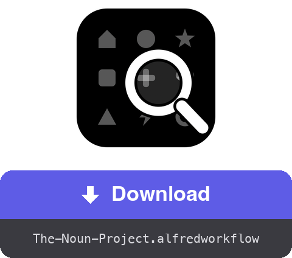

<a href="dist/The-Noun-Project.alfredworkflow?raw=true"></a>

<table>
  <tr><td align="center"><a href="README.fr.md"></a><br><a href="README.fr.md"><sub>Français</sub></a></td><td align="center"><a href="README.de.md"></a><br><a href="README.de.md"><sub>Deutsch</sub></a></td><td align="center"><a href="README.es.md"></a><br><a href="README.es.md"><sub>Español</sub></a></td><td align="center"><a href="README.it.md"></a><br><a href="README.it.md"><sub>Italiano</sub></a></td><td align="center"><a href="README.pt.md"></a><br><a href="README.pt.md"><sub>Português</sub></a></td><td align="center"><a href="README.ja.md"></a><br><a href="README.ja.md"><sub>日本語</sub></a></td><td align="center"><a href="README.zh.md"></a><br><a href="README.zh.md"><sub>中文</sub></a></td><td align="center"><a href="README.el.md"></a><br><a href="README.el.md"><sub>Ελληνικά</sub></a></td></tr>
</table>

###### ALFRED WORKFLOW
# Search and download Noun Project icons

**Search millions of Noun Project icons and grab the SVG or PNG without leaving your keyboard.**

Type `noun house`, pick, press **⏎**. The file lands in your folder — clean, at the right size.


## ✨ What it does

- **Instant search** → results with thumbnails; public-domain icons come first, tagged 🟢
- **A whole shortcut grid** → ⏎ downloads the default format, ⌥ switches to the other one, ⇧ copies instead of saving, ⌃ targets the attribution (.txt), and ⌘ combines them — up to ⌘⌥⇧⌃⏎, which copies everything in a row
- **Options flow** → the ▸ submenu (⇥ autocomplete) lists all twelve actions plus a guided flow: format → size → destination folder
- **Attribution at hand** → the credit line can be saved as .txt or copied, alone or along with the image (successive copies all land in your clipboard history)
- **Cleanup** → the embedded “Created by…” notice in free files is removed (PNG cropped, text stripped from the SVG code); CC BY then requires credit elsewhere — ⇧⌃⏎ copies it
- **Your own session** → an invisible background Chrome uses your thenounproject.com account — full catalogue, according to your subscription
- **Localized** → interface and notifications follow your macOS language (English, French, German, Spanish, Italian, Portuguese, Japanese, Chinese, Greek)

## 🚀 Install

1. Download `The-Noun-Project.alfredworkflow` and double-click it
2. Install Node.js if needed: `brew install node` (Python 3 comes with the Command Line Tools: `xcode-select --install`)
3. Run a first search — `noun house` — Playwright and Chromium install themselves (a few minutes, once)
4. Type `nounctl` → “Sign in”: a Chrome window opens, sign in on the site, it closes by itself. The session persists in a dedicated profile, separate from your everyday browser

Requires [Alfred 5](https://www.alfredapp.com) with the [Powerpack](https://www.alfredapp.com/powerpack/).

## ⚙️ Configuration


Backend (Browser or official API), default format (SVG or PNG — the other becomes the “alternate” one), keyword, download folder, default PNG size, colour, number of results, notice cleanup, reveal in Finder. In API mode (key/secret from [thenounproject.com/developers/apps](https://thenounproject.com/developers/apps/)), the free tier only allows public-domain downloads.

## ⌨️ Shortcuts

| Key | Action |
|---|---|
| ⏎ | Download the default format |
| ⌥⏎ | Download the alternate format |
| ⌃⏎ | Download the attribution as .txt |
| ⇧⏎ | Copy the default format to the clipboard |
| ⇧⌥⏎ | Copy the alternate format |
| ⇧⌃⏎ | Copy the attribution |
| ⌘⏎ | Download attribution + default format |
| ⌘⌥⏎ | Download attribution + alternate format |
| ⌘⇧⏎ | Copy the attribution, then the default format |
| ⌘⇧⌥⏎ | Copy the attribution, then the alternate format |
| ⌘⌥⌃⏎ | Download both formats + the attribution |
| ⌘⌥⇧⌃⏎ | Copy the attribution, the alternate, then the default format |
| ⇥ | Submenu with every action (autocomplete — if ⇥ isn't bound to Alfred's Universal Actions) |
| ⌘Y | Quick Look preview of the icon's page |

`nounctl`: sign-in, status, stop/restart of the background browser, reinstall, logs.

## 🔧 How it works

A Node/[Playwright](https://playwright.dev) daemon ([`workflow/server.mjs`](workflow/server.mjs)) runs in the background with an invisible Chromium and a persistent profile. Search goes through the site's internal API (no account needed); downloads go through the `downloadIcon` GraphQL mutation with your session — the file comes back as base64, gets cleaned up, then saved or copied. The daemon stops after 3 hours of inactivity and restarts on demand.

No credentials ever pass through the workflow: you sign in by hand in the Chrome window, and the cookies stay in the local profile. This automates your own session, for your personal use — stay within your subscription and the site's terms of use.

## 🛠 Development

```bash
(cd workflow && zip -r "../dist/The-Noun-Project.alfredworkflow" . -x '.*' -x '__pycache__/*')  # package the workflow
osascript -l JavaScript tools/make-icon.js "$PWD/workflow/icon.png"  # regenerate workflow/icon.png
node tools/make-screenshots.mjs   # regenerate the screenshots
tools/make-readmes.py             # regenerate all README files
tools/make-buttons.py             # regenerate the download buttons
```

- `workflow/` — sources: `info.plist`, Python scripts (stdlib only), the `server.mjs` daemon, `i18n.py` (9 languages)
- The daemon exposes a small local HTTP API (`/search`, `/download`, `/login`, `/status`, `/quit`) on 127.0.0.1
- `dist/` — the installable bundle

## 📚 References

- [Alfred](https://www.alfredapp.com) · [Powerpack](https://www.alfredapp.com/powerpack/) · [Workflows documentation](https://www.alfredapp.com/help/workflows/)
- [The Noun Project](https://thenounproject.com) · [Official API](https://api.thenounproject.com) · [Licenses](https://thenounproject.com/legal/terms-of-use/)
- [Playwright](https://playwright.dev)

## 📄 License

MIT. The icons themselves remain governed by The Noun Project licenses (CC BY or public domain, subscription where applicable).

---

Made by <a href='https://damiencuvillier.com' target='_blank' rel='noopener'>Damien</a> · Issues and PRs welcome
