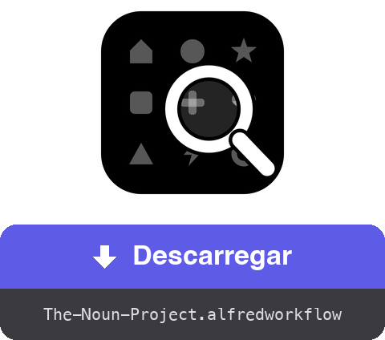

<a href="dist/The-Noun-Project.alfredworkflow?raw=true"></a>

<table>
  <tr><td align="center"><a href="README.md"></a><br><a href="README.md"><sub>English</sub></a></td><td align="center"><a href="README.fr.md"></a><br><a href="README.fr.md"><sub>Français</sub></a></td><td align="center"><a href="README.de.md"></a><br><a href="README.de.md"><sub>Deutsch</sub></a></td><td align="center"><a href="README.es.md"></a><br><a href="README.es.md"><sub>Español</sub></a></td><td align="center"><a href="README.it.md"></a><br><a href="README.it.md"><sub>Italiano</sub></a></td><td align="center"><a href="README.ja.md"></a><br><a href="README.ja.md"><sub>日本語</sub></a></td><td align="center"><a href="README.zh.md"></a><br><a href="README.zh.md"><sub>中文</sub></a></td><td align="center"><a href="README.el.md"></a><br><a href="README.el.md"><sub>Ελληνικά</sub></a></td></tr>
</table>

###### ALFRED WORKFLOW
# Pesquisar e descarregar ícones do Noun Project

**Pesquisa entre milhões de pictogramas do Noun Project e obtém o SVG ou o PNG sem largar o teclado.**

Escreve `noun casa`, escolhe, prime **⏎**. O ficheiro fica na tua pasta — limpo, no tamanho certo.


## ✨ O que faz

- **Pesquisa instantânea** → resultados com miniaturas; os ícones do domínio público aparecem primeiro, marcados com 🟢
- **Uma grelha completa de atalhos** → ⏎ descarrega o formato padrão, ⌥ muda para o outro, ⇧ copia em vez de guardar, ⌃ aponta para a menção de atribuição (.txt) e ⌘ combina-os — até ⌘⌥⇧⌃⏎, que copia tudo de seguida
- **Fluxo de opções** → o submenu ▸ (autocompletar ⇥) lista as doze ações mais um fluxo guiado: formato → tamanho → pasta de destino
- **Atribuição sempre à mão** → a menção de atribuição pode ser guardada em .txt ou copiada, sozinha ou juntamente com a imagem (as cópias sucessivas ficam todas no histórico da área de transferência)
- **Limpeza** → a menção «Created by…» incrustada nos ficheiros gratuitos é removida (PNG recortado, texto retirado do código SVG); a licença CC BY passa então a exigir um crédito noutro lugar — ⇧⌃⏎ copia-o
- **A tua própria sessão** → um Chrome invisível em segundo plano usa a tua conta thenounproject.com — catálogo completo, consoante a tua subscrição
- **Localizado** → interface e notificações seguem o idioma do teu macOS (inglês, francês, alemão, espanhol, italiano, português, japonês, chinês, grego)

## 🚀 Instalação

1. Descarrega `The-Noun-Project.alfredworkflow` e faz duplo clique
2. Instala o Node.js se necessário: `brew install node` (o Python 3 vem com as Command Line Tools: `xcode-select --install`)
3. Lança uma primeira pesquisa — `noun casa` — o Playwright e o Chromium instalam-se sozinhos (alguns minutos, uma única vez)
4. Escreve `nounctl` → «Iniciar sessão»: abre-se uma janela do Chrome, autentica-te no site e ela fecha-se sozinha. A sessão persiste num perfil dedicado, separado do teu navegador habitual

Requer [Alfred 5](https://www.alfredapp.com) com o [Powerpack](https://www.alfredapp.com/powerpack/).

## ⚙️ Configuração


Backend (Navegador ou API oficial), formato padrão (SVG ou PNG — o outro passa a ser o «alternativo»), palavra-chave, pasta de descargas, tamanho PNG padrão, cor, número de resultados, limpeza da menção, mostrar no Finder. Em modo API (chave/segredo em [thenounproject.com/developers/apps](https://thenounproject.com/developers/apps/)), o acesso gratuito limita as descargas ao domínio público.

## ⌨️ Atalhos

| Tecla | Ação |
|---|---|
| ⏎ | Descarregar o formato padrão |
| ⌥⏎ | Descarregar o formato alternativo |
| ⌃⏎ | Descarregar a menção de atribuição em .txt |
| ⇧⏎ | Copiar o formato padrão para a área de transferência |
| ⇧⌥⏎ | Copiar o formato alternativo |
| ⇧⌃⏎ | Copiar a menção de atribuição |
| ⌘⏎ | Descarregar a menção de atribuição + o formato padrão |
| ⌘⌥⏎ | Descarregar a menção de atribuição + o formato alternativo |
| ⌘⇧⏎ | Copiar a menção de atribuição, depois o formato padrão |
| ⌘⇧⌥⏎ | Copiar a menção de atribuição, depois o formato alternativo |
| ⌘⌥⌃⏎ | Descarregar os dois formatos + a menção de atribuição |
| ⌘⌥⇧⌃⏎ | Copiar a menção de atribuição, o alternativo e depois o formato padrão |
| ⇥ | Submenu com todas as ações (autocompletar — se ⇥ não estiver atribuída às Universal Actions do Alfred) |
| ⌘Y | Pré-visualização Quick Look da página do ícone |

`nounctl`: iniciar sessão, estado, parar/reiniciar o navegador de fundo, reinstalação, registos.

## 🔧 Como funciona

Um daemon Node/[Playwright](https://playwright.dev) ([`workflow/server.mjs`](workflow/server.mjs)) corre em segundo plano com um Chromium invisível e um perfil persistente. A pesquisa consulta a API interna do site (sem conta); a descarga passa pela mutação GraphQL `downloadIcon` com a tua sessão — o ficheiro chega em base64, é limpo e depois guardado ou copiado. O daemon encerra-se após 3 h de inatividade e reinicia a pedido.

Nenhuma credencial passa pelo workflow: a autenticação faz-se à mão na janela do Chrome e os cookies ficam no perfil local. Este modo automatiza a tua própria sessão, para uso pessoal — mantém-te dentro dos limites da tua subscrição e dos termos de utilização do site.

## 🛠 Desenvolvimento

```bash
./build                           # empacota o workflow
osascript -l JavaScript tools/make-icon.js "$PWD/workflow/icon.png"  # regenera workflow/icon.png
node tools/make-screenshots.mjs   # regenera as capturas de ecrã
tools/make-readmes.py             # regenera todos os README
tools/make-buttons.py             # regenera os botões de descarga
```

- `workflow/` — fontes: `info.plist`, scripts Python (apenas stdlib), o daemon `server.mjs`, `i18n.py` (9 idiomas)
- O daemon expõe uma pequena API HTTP local (`/search`, `/download`, `/login`, `/status`, `/quit`) em 127.0.0.1
- `dist/` — o pacote instalável

[](https://www.python.org) [](https://playwright.dev) [](https://claude.com)

## 📚 Referências

- [Alfred](https://www.alfredapp.com) · [Powerpack](https://www.alfredapp.com/powerpack/) · [Documentação de workflows](https://www.alfredapp.com/help/workflows/)
- [The Noun Project](https://thenounproject.com) · [API oficial](https://api.thenounproject.com) · [Licenças](https://thenounproject.com/legal/terms-of-use/)
- [Playwright](https://playwright.dev)

## 📄 Licença

MIT. Os ícones continuam sujeitos às licenças do The Noun Project (CC BY ou domínio público, subscrição quando aplicável).

---

Feito por <a href='https://damiencuvillier.com' target='_blank' rel='noopener'>Damien</a> · Issues e PRs bem-vindos

*O código deste workflow foi gerado com a ajuda de um LLM (Claude Code) — concebido e testado por um humano ;-)*
