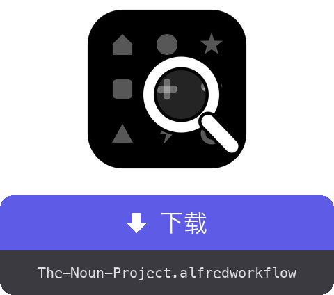

<a href="dist/The-Noun-Project.alfredworkflow?raw=true"></a>

<table>
  <tr><td align="center"><a href="README.md"></a><br><a href="README.md"><sub>English</sub></a></td><td align="center"><a href="README.fr.md"></a><br><a href="README.fr.md"><sub>Français</sub></a></td><td align="center"><a href="README.de.md"></a><br><a href="README.de.md"><sub>Deutsch</sub></a></td><td align="center"><a href="README.es.md"></a><br><a href="README.es.md"><sub>Español</sub></a></td><td align="center"><a href="README.it.md"></a><br><a href="README.it.md"><sub>Italiano</sub></a></td><td align="center"><a href="README.pt.md"></a><br><a href="README.pt.md"><sub>Português</sub></a></td><td align="center"><a href="README.ja.md"></a><br><a href="README.ja.md"><sub>日本語</sub></a></td><td align="center"><a href="README.el.md"></a><br><a href="README.el.md"><sub>Ελληνικά</sub></a></td></tr>
</table>

###### ALFRED WORKFLOW
# 搜索并下载 Noun Project 图标

**在 Noun Project 的数百万个图标中搜索，不离开键盘即可获取 SVG 或 PNG。**

输入 `noun house`，选中，按 **⏎**。文件已在你的文件夹里——干净，尺寸正好。


## ✨ 功能

- **即时搜索** → 结果带缩略图；公共领域图标排在最前，并标注 🟢
- **一整套组合快捷键** → ⏎ 下载默认格式，⌥ 切换到另一种格式，⇧ 改为复制而非保存，⌃ 针对署名信息（.txt），⌘ 负责组合——直到 ⌘⌥⇧⌃⏎ 一口气复制全部内容
- **选项流程** → ▸ 子菜单（⇥ 自动补全）列出全部十二个操作，外加一个引导流程：格式 → 尺寸 → 目标文件夹
- **署名信息随手可得** → 署名信息可保存为 .txt 或复制，可单独操作，也可与图像一起（连续复制的内容都会保留在剪贴板历史中）
- **自动清理** → 免费文件中内嵌的“Created by…”字样会被去除（PNG 裁剪，SVG 代码中的文字删除）；CC BY 许可因此要求在别处注明出处——⇧⌃⏎ 即可复制署名信息
- **个人会话** → 后台一个隐形 Chrome 使用你的 thenounproject.com 账户——完整目录，范围取决于你的订阅
- **本地化** → 界面与通知跟随 macOS 系统语言（英语、法语、德语、西班牙语、意大利语、葡萄牙语、日语、中文、希腊语）

## 🚀 安装

1. 下载 `The-Noun-Project.alfredworkflow` 并双击
2. 如有需要安装 Node.js：`brew install node`（Python 3 由 Command Line Tools 提供：`xcode-select --install`）
3. 进行第一次搜索——`noun house`——Playwright 与 Chromium 会自动安装（几分钟，仅需一次）
4. 输入 `nounctl` → “登录”：会弹出一个 Chrome 窗口，在网站上完成登录后窗口自动关闭。会话保存在独立的专用配置文件中，与你日常使用的浏览器互不干扰

需要 [Alfred 5](https://www.alfredapp.com) 及 [Powerpack](https://www.alfredapp.com/powerpack/)。

## ⚙️ 设置


后端（浏览器或官方 API）、默认格式（SVG 或 PNG——另一种即为“备用”格式）、关键词、下载文件夹、默认 PNG 尺寸、颜色、结果数量、署名清理、在 Finder 中显示。API 模式下（在 [thenounproject.com/developers/apps](https://thenounproject.com/developers/apps/) 获取 key/secret），免费额度只能下载公共领域的图标。

## ⌨️ 快捷键

| 按键 | 操作 |
|---|---|
| ⏎ | 下载默认格式 |
| ⌥⏎ | 下载备用格式 |
| ⌃⏎ | 将署名信息下载为 .txt |
| ⇧⏎ | 复制默认格式到剪贴板 |
| ⇧⌥⏎ | 复制备用格式 |
| ⇧⌃⏎ | 复制署名信息 |
| ⌘⏎ | 下载署名信息 + 默认格式 |
| ⌘⌥⏎ | 下载署名信息 + 备用格式 |
| ⌘⇧⏎ | 先复制署名信息，再复制默认格式 |
| ⌘⇧⌥⏎ | 先复制署名信息，再复制备用格式 |
| ⌘⌥⌃⏎ | 下载两种格式 + 署名信息 |
| ⌘⌥⇧⌃⏎ | 依次复制署名信息、备用格式和默认格式 |
| ⇥ | 包含全部操作的子菜单（自动补全——若 ⇥ 未绑定到 Alfred 的 Universal Actions） |
| ⌘Y | Quick Look 预览图标页面 |

`nounctl`：登录、状态、停止/重启后台浏览器、重新安装、查看日志。

## 🔧 工作原理

一个 Node/[Playwright](https://playwright.dev) 守护进程（[`workflow/server.mjs`](workflow/server.mjs)）在后台运行，带一个隐形 Chromium 和持久化的浏览器配置文件。搜索调用网站的内部 API（无需账户）；下载则携带你的会话执行 GraphQL mutation `downloadIcon`——文件以 base64 形式返回，经清理后保存或复制。守护进程闲置 3 小时后自动退出，需要时按需重启。

任何账号密码都不会经过工作流：登录由你在 Chrome 窗口中手动完成，Cookie 只保存在本地配置文件里。此模式只是自动化你自己的会话、供你个人使用——请遵守你的订阅范围与网站的服务条款。

## 🛠 开发

```bash
(cd workflow && zip -r "../dist/The-Noun-Project.alfredworkflow" . -x '.*' -x '__pycache__/*')  # 打包工作流
osascript -l JavaScript tools/make-icon.js "$PWD/workflow/icon.png"  # 重新生成 workflow/icon.png
node tools/make-screenshots.mjs   # 重新生成截图
tools/make-readmes.py             # 重新生成所有 README
tools/make-buttons.py             # 重新生成下载按钮
```

- `workflow/` —— 源码：`info.plist`、Python 脚本（仅标准库）、守护进程 `server.mjs`、`i18n.py`（9 种语言）
- 守护进程在 127.0.0.1 上提供一个小型本地 HTTP API（`/search`、`/download`、`/login`、`/status`、`/quit`）
- `dist/` —— 可安装的工作流包

## 📚 参考

- [Alfred](https://www.alfredapp.com) · [Powerpack](https://www.alfredapp.com/powerpack/) · [工作流文档](https://www.alfredapp.com/help/workflows/)
- [The Noun Project](https://thenounproject.com) · [官方 API](https://api.thenounproject.com) · [许可条款](https://thenounproject.com/legal/terms-of-use/)
- [Playwright](https://playwright.dev)

## 📄 许可证

MIT。图标本身仍受 The Noun Project 相关许可约束（CC BY 或公共领域，如有订阅则按订阅许可）。

---

作者：<a href='https://damiencuvillier.com' target='_blank' rel='noopener'>Damien</a> · 欢迎提交 Issue 和 PR
